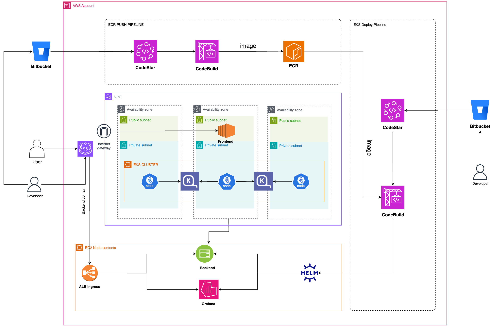

# TwinCiti Terraform IAC

## Summary

This Terraform module facilitates the deployment of a comprehensive infrastructure setup within an AWS environment. The key components deployed by this module include:

- **VPC (Virtual Private Cloud)**: A logically isolated network within the AWS cloud to securely launch AWS resources.
- **EKS (Elastic Kubernetes Service)**: A managed Kubernetes service to run and scale containerized applications.
- **Helm**: A package manager for Kubernetes that helps in managing and deploying applications.
- **AWS CodePipeline**: A continuous integration and continuous delivery (CI/CD) service for fast and reliable application and infrastructure updates.
- **Karpenter**: An open-source node provisioning project built to help manage Kubernetes clusters.
- **Prometheus**: A monitoring and alerting toolkit designed for reliability and scalability. 

This module ensures a robust and scalable environment for deploying and managing containerized applications on AWS.

## Arcitacture Diagram



# VPC Module Configuration

This Terraform module configures a Virtual Private Cloud (VPC) using the `terraform-aws-modules/vpc/aws` module. The configuration includes both public and private subnets, NAT gateways, and flow logs. Below is a summary of the key settings and components.

## Summary

- **Source Module**: `terraform-aws-modules/vpc/aws`
- **VPC Name**: Derived from `local.name`
- **CIDR Block**: `var.vpc_cidr`
- **Availability Zones**: `local.azs`
- **Private Subnets**: Derived from `var.vpc_cidr` with a /20 subnet mask
- **Public Subnets**: Derived from `var.vpc_cidr` with a /16 subnet mask, shifted by 48 bits
- **Public IP Mapping**: Enabled for instances in public subnets
- **NAT Gateway**: Enabled, single NAT gateway setup
- **Flow Logs**: Enabled, sent to CloudWatch Logs with a retention period of 30 days

## Key Components

### Subnets

- **Private Subnets**:
  ```hcl
  private_subnets = [for k, v in local.azs : cidrsubnet(var.vpc_cidr, 4, k)]
  ```
  These subnets are designated for internal resources.

- **Public Subnets**:
  ```hcl
  public_subnets = [for k, v in local.azs : cidrsubnet(var.vpc_cidr, 8, k + 48)]
  ```
  These subnets are designated for resources that need public internet access.

### NAT Gateway

- **Single NAT Gateway**: Ensures private subnets can access the internet.
  ```hcl
  enable_nat_gateway = true
  single_nat_gateway = true
  ```

### Subnet Tags

- **Public Subnet Tags**:
  ```hcl
  public_subnet_tags = {
    "kubernetes.io/role/elb" = 1
  }
  ```

- **Private Subnet Tags**:
  ```hcl
  private_subnet_tags = {
    "kubernetes.io/role/internal-elb" = 1
    "karpenter.sh/discovery" = "${local.name}-cluster"
  }
  ```

### Flow Logs

- **Enable Flow Logs**:
  ```hcl
  enable_flow_log = var.enable_flow_logs
  flow_log_destination_type = "cloud-watch-logs"
  flow_log_cloudwatch_log_group_retention_in_days = 30
  create_flow_log_cloudwatch_iam_role = var.enable_flow_logs
  create_flow_log_cloudwatch_log_group = var.enable_flow_logs
  ```

# EKS Module Configuration

This Terraform module configures an Amazon EKS cluster using the `terraform-aws-modules/eks/aws` module. The configuration includes setting up cluster add-ons, managed node groups, and authentication.

## Summary

- **Source Module**: `terraform-aws-modules/eks/aws`
- **EKS Cluster Name**: `${local.name}-cluster`
- **EKS Version**: `1.28`
- **VPC**: Uses `module.vpc.vpc_id` and private subnets
- **Public Endpoint**: Enabled

## Key Components

### Cluster Add-ons

- **CoreDNS**, **kube-proxy**, **VPC-CNI**, **AWS EBS CSI Driver**: Configured to use the most recent version.

### Managed Node Groups

- **Node Group Configuration**:
  ```hcl
  eks_managed_node_groups = {
    baseline-infra = {
      instance_types = [var.node_type]
      min_size       = 2
      max_size       = 2
      desired_size   = 2
      metadata_options = {
        http_endpoint               = "enabled"
        http_tokens                 = "required"
        http_put_response_hop_limit = 3
        instance_metadata_tags      = "disabled"
      }
      iam_role_additional_policies = {
        AmazonEBSCSIDriverPolicy  = "arn:aws:iam::aws:policy/service-role/AmazonEBSCSIDriverPolicy"
      }
    }
  }
  ```

### Security Group Tags

- **Node Security Group Tags**:
  ```hcl
  node_security_group_tags = {
    "kubernetes.io/cluster/${local.name}-cluster" = null
  }
  ```

### Additional Tags

- **Tags**:
  ```hcl
  tags = merge(local.tags, {
    "karpenter.sh/discovery" = "${local.name}-cluster"
  })
  ```

### Authentication

- **EKS Authentication**:
  ```hcl
  module "eks_auth" {
    source = "aidanmelen/eks-auth/aws"
    eks    = module.eks

    map_roles = [
      {
        rolearn  = module.eks_blueprints_addons.karpenter.node_iam_role_arn
        username = "system:node:{{EC2PrivateDNSName}}"
        groups   = ["system:bootstrappers", "system:nodes"]
      }
    ]
  }
  ```

This configuration sets up a robust EKS cluster with necessary add-ons, managed node groups, and authentication mechanisms.

# EKS Blueprints Add-ons Module Configuration

This Terraform module configures various add-ons for an Amazon EKS cluster using the `aws-ia/eks-blueprints-addons/aws` module. It includes configurations for Karpenter, AWS Load Balancer Controller, and several Helm releases for deploying additional resources.

## Summary

- **Source Module**: `aws-ia/eks-blueprints-addons/aws`
- **Version**: `1.16.3`
- **Cluster Name**: `module.eks.cluster_name`
- **OIDC Provider ARN**: `module.eks.oidc_provider_arn`
- **Key Add-ons**:
  - AWS Load Balancer Controller: Enabled
  - Karpenter: Enabled with spot termination handling

## Key Components

### Karpenter Configuration

- **Repository Authentication**:
  ```hcl
  karpenter = {
    repository_username = data.aws_ecrpublic_authorization_token.token.user_name
    repository_password = data.aws_ecrpublic_authorization_token.token.password
  }
  ```

- **Spot Termination Handling**:
  ```hcl
  karpenter_enable_spot_termination = true
  ```

### Helm Releases

- **Karpenter Resources**:
  ```hcl
  helm_releases = {
    karpenter-resources-default = {
      name        = "karpenter-resources-basic"
      description = "A Helm chart for karpenter CPU based resources basic tier"
      chart       = "${path.module}/helm-charts/karpenter"
      values = [<<-EOT
        clusterName: ${module.eks.cluster_name}
        subnetname: ${local.name}
        deviceName: "/dev/xvda"
        instanceName: backend-karpenter-node
        iamRoleName: ${module.eks_blueprints_addons.karpenter.node_iam_role_name}
        instanceFamilies: ["m5"]
        amiFamily: AL2023
        taints: []
        labels: []
      EOT
      ]
    }
  }
  ```

This configuration sets up essential EKS add-ons and deploys additional resources using Helm charts.

# Explanation of Helm Releases

This section provides a detailed explanation of the Helm releases configured in the `eks_blueprints_addons` module. Each Helm release is used to deploy specific resources to the EKS cluster, with custom configurations provided through Helm values.

## Helm Releases

### 1. Karpenter Resources

**Name**: `karpenter-resources-basic`

**Description**: A Helm chart for Karpenter CPU-based resources basic tier.

**Chart Path**: `${path.module}/helm-charts/karpenter`

**Values**:
```yaml
clusterName: ${module.eks.cluster_name}
subnetname: ${local.name}
deviceName: "/dev/xvda"
instanceName: backend-karpenter-node
iamRoleName: ${module.eks_blueprints_addons.karpenter.node_iam_role_name}
instanceFamilies: ["m5"]
amiFamily: AL2023
taints: []
labels: []
```

**Explanation**:
- **clusterName**: The name of the EKS cluster.
- **subnetname**: The name of the subnet for Karpenter.
- **deviceName**: Device name for instances.
- **instanceName**: Name assigned to Karpenter nodes.
- **iamRoleName**: IAM role name for Karpenter nodes.
- **instanceFamilies**: Instance families to be used (e.g., m5).
- **amiFamily**: AMI family to be used (e.g., AL2023).
- **taints**: Node taints for scheduling.
- **labels**: Node labels for identification.

### 2. Kube Prometeous Stack

The Kube Prometheus Stack is a collection of Kubernetes-native services and configurations for monitoring and observability within Kubernetes clusters. It leverages the Prometheus monitoring system and integrates it with Grafana for visualization and Alertmanager for alerting.

Here's a breakdown of its components:

1. **Prometheus**: A time-series database and monitoring system that collects metrics from configured targets at regular intervals, evaluates rule expressions, displays the results, and can trigger alerts if necessary.

2. **Grafana**: A popular open-source platform for analytics and monitoring. Grafana allows users to query, visualize, alert on, and understand metrics no matter where they are stored.

3. **Alertmanager**: Handles alerts sent by client applications such as the Prometheus server. It takes care of deduplicating, grouping, and routing them to the correct receiver integration (like email, PagerDuty, or custom webhooks).

The Kube Prometheus Stack simplifies the deployment and management of these components within Kubernetes clusters. It provides predefined configurations, dashboards, and alerting rules tailored for monitoring Kubernetes infrastructure and applications running within it.

This Helm values file is configuring the installation of the Kube Prometheus Stack, which includes Grafana, Prometheus, and Alertmanager components. Here's a summary:

- **Grafana**:
  - Enabled with admin password generated dynamically.
  - Additional data source configured for CloudWatch.
  - Ingress configured with ALB (Application Load Balancer) settings for external access.

- **Prometheus**:
  - Retention policy set to 15 days.
  - Ingress configured with ALB settings for external access.

- **Alertmanager**:
  - Enabled with ALB settings for external access.
  - Inhibition rules defined for handling alerts.
  - Routing rules defined for different receivers, including Discord webhook integration for alert notifications.

The setup is designed to provide monitoring capabilities with external access through ALB, dynamic configuration using Terraform variables, and integration with Discord for alert notifications.

## Pipelines

### ECR Push Pipeline

This pipeline is designed to automate the process of building and pushing Docker images to Amazon Elastic Container Registry (ECR) using AWS CodePipeline and AWS CodeBuild.

### Basic Functionality

### AWS CodeBuild Project

The `aws_codebuild_project` resource defines a CodeBuild project with the following key functionalities:
- **Name**: `ecr-push-pipeline-project`
- **Build Timeout**: 5 minutes
- **Artifacts**: Integrates with CodePipeline
- **Environment**: Configured to use a small Linux container with Docker support and necessary environment variables for the AWS region, account ID, and ECR repository name.

### AWS CodePipeline

The `aws_codepipeline` resource sets up a pipeline with two main stages:
- **Source Stage**: 
  - Retrieves the source code from a Bitbucket repository.
  - Monitors the `adeel-dev` branch for changes.
- **Build Stage**: 
  - Uses AWS CodeBuild to build the Docker image.
  - Pushes the built image to the specified ECR repository.

### Bitbucket Connection

The `aws_codestarconnections_connection` resource establishes a connection to a Bitbucket repository for the source stage of the pipeline.

### Buildspec Configuration

The `buildspec.yaml` file contains the build instructions:
- **Pre-Build**:
  - Logs in to Amazon ECR.
  - Calculates the image tag using the current date and build number.
- **Build**:
  - Builds the Docker image.
  - Tags the image with the calculated tag.
- **Post-Build**:
  - Pushes the Docker image to ECR.


### EKS Deploy Pipeline

This pipeline automates the process of deploying Docker images to an Amazon EKS (Elastic Kubernetes Service) cluster using AWS CodePipeline and AWS CodeBuild.

### Basic Functionality

### AWS CodeBuild Project

The `aws_codebuild_project` resource defines a CodeBuild project with the following key functionalities:
- **Name**: `eks-deploy-pipeline-project`
- **Build Timeout**: 5 minutes
- **Artifacts**: Integrates with CodePipeline
- **Environment**: Configured to use a small Linux container with Docker support and necessary environment variables for the AWS region, EKS cluster, IAM roles, and secrets.

### AWS CodePipeline

The `aws_codepipeline` resource sets up a pipeline with two main stages:
- **Source Stage**: 
  - Retrieves the source code from a Bitbucket repository.
  - Monitors the `dev` branch for changes.
- **Build Stage**: 
  - Uses AWS CodeBuild to build the Docker image and deploy it to the EKS cluster.

### Bitbucket Connection

The `aws_codestarconnections_connection` resource establishes a connection to a Bitbucket repository for the source stage of the pipeline.

### Buildspec Configuration

The `buildspec.yaml` file contains the build instructions:
- **Pre-Build**:
  - Checks if the specified Docker image tag exists in ECR.
- **Install**:
  - Installs Helm and kubectl if they are not already installed.
- **Build**:
  - Assumes the necessary IAM role to update the kubeconfig for EKS.
  - Deploys the application to the EKS cluster using Helm.

## Deployment

This guide outlines the steps to deploy Fast API on Amazon EKS using Terraform. The deployment includes setting up the necessary infrastructure such as VPC, EKS cluster, and other resources required to run Fast API.

### Prerequisites

Before you begin, ensure you have the following:

- AWS CLI installed and configured with appropriate credentials.
- Terraform CLI installed on your local machine.
- Basic understanding of Amazon EKS, Terraform, and Kubernetes concepts.

### Steps

### 1. Create Cloudflare Key

Details are mentioned in this [readme](./ansible/cloud-flare-key-secret/README.md)

### 2. Create secrets for backend application

Details are mentioned in this [readme](./ansible/secrets-creation/README.md)

### 3. Create secrets for discord URLS

Details are mentioned in this [readme](./ansible/discord-url-secret/README.md)

### 3. Create Backend 

In the `scripts` dir, `pre-create.sh` script used to deploy the intial resources in new account.
It will deploy the s3 bucket and dynamoDB for keeping the terraform stae and lock files.  edit these values accordingly or let them remain same 
```
dynamo_table_name="terraform-lock"
bucket_name="twin-citi-terraform-state-bucket"
```
After updating these values run the script using this command:

```
bash  ./scripts/pre-create.sh <region>

exapmle:

bash  ./scripts/pre-create.sh us-east-1
```

### 4. Update backend

Update the backend in `providers.tf` file. like name of s3 bucket and dynamoDB table if same as the specified ones in pre-create.sh script

```
  backend "s3" {
    bucket         = "twin-citi-terraform-state-bucket"
    key            = "terraform.tfstate"
    region         = "us-east-1"
    dynamodb_table = "terraform-lock"
  }
```

also update the account ID.

```
  allowed_account_ids = ["058264243973"]
```

### 5. Update Terraform Variables

Open the `variables.tf` file and update the variables according to your requirements. You may need to modify variables such as `aws_region`, `vpc_cidr`, `node_type`, etc., to match your environment.

### 6. Initialize Terraform

Initialize the Terraform environment to download required plugins and modules:

```bash
terraform init
```

### 7. Review Terraform Plan

Review the Terraform plan to ensure it will create the desired infrastructure:

```bash
terraform plan
```

### 8. Deploy Infrastructure

Apply the Terraform configuration to deploy the infrastructure on AWS:

```bash
terraform apply
```

### 9. Run the Post apply terraoform with same steps 

Details are mentioned in this [readme](./post-infra-terraform/README.md)


### 10. Clean UP

```bash
terraform destroy
```

Confirm the deletion when prompted.

## Additional Notes

- Ensure you have necessary permissions and privileges to create and manage resources on AWS.
- Customize the Fast API application according to your requirements before deploying it on EKS.

<!-- BEGIN_TF_DOCS -->
## Requirements

| Name | Version |
|------|---------|
| <a name="requirement_terraform"></a> [terraform](#requirement\_terraform) | >= 1.0 |
| <a name="requirement_aws"></a> [aws](#requirement\_aws) | >= 4.5.0 |
| <a name="requirement_cloudflare"></a> [cloudflare](#requirement\_cloudflare) | >= 4.20 |
| <a name="requirement_helm"></a> [helm](#requirement\_helm) | >= 2.4.1 |
| <a name="requirement_kubectl"></a> [kubectl](#requirement\_kubectl) | >= 1.14 |
| <a name="requirement_kubernetes"></a> [kubernetes](#requirement\_kubernetes) | >= 2.10 |
| <a name="requirement_random"></a> [random](#requirement\_random) | >= 3.4 |

## Providers

| Name | Version |
|------|---------|
| <a name="provider_aws"></a> [aws](#provider\_aws) | 5.52.0 |
| <a name="provider_aws.ecr"></a> [aws.ecr](#provider\_aws.ecr) | 5.52.0 |
| <a name="provider_cloudflare"></a> [cloudflare](#provider\_cloudflare) | 4.34.0 |
| <a name="provider_local"></a> [local](#provider\_local) | 2.5.1 |
| <a name="provider_random"></a> [random](#provider\_random) | 3.6.2 |
| <a name="provider_tls"></a> [tls](#provider\_tls) | 4.0.5 |

## Modules

| Name | Source | Version |
|------|--------|---------|
| <a name="module_eks"></a> [eks](#module\_eks) | terraform-aws-modules/eks/aws | ~> 20.0 |
| <a name="module_eks_auth"></a> [eks\_auth](#module\_eks\_auth) | aidanmelen/eks-auth/aws | n/a |
| <a name="module_eks_blueprints_addons"></a> [eks\_blueprints\_addons](#module\_eks\_blueprints\_addons) | aws-ia/eks-blueprints-addons/aws | 1.16.3 |
| <a name="module_vpc"></a> [vpc](#module\_vpc) | terraform-aws-modules/vpc/aws | n/a |

## Resources

| Name | Type |
|------|------|
| [aws_acm_certificate.this](https://registry.terraform.io/providers/hashicorp/aws/latest/docs/resources/acm_certificate) | resource |
| [aws_acm_certificate_validation.this](https://registry.terraform.io/providers/hashicorp/aws/latest/docs/resources/acm_certificate_validation) | resource |
| [aws_codebuild_project.ecr_push_pipeline_project](https://registry.terraform.io/providers/hashicorp/aws/latest/docs/resources/codebuild_project) | resource |
| [aws_codebuild_project.eks_deploy_pipeline_project](https://registry.terraform.io/providers/hashicorp/aws/latest/docs/resources/codebuild_project) | resource |
| [aws_codepipeline.ecr_push_pipeline](https://registry.terraform.io/providers/hashicorp/aws/latest/docs/resources/codepipeline) | resource |
| [aws_codepipeline.eks_deploy_pipeline_project](https://registry.terraform.io/providers/hashicorp/aws/latest/docs/resources/codepipeline) | resource |
| [aws_codestarconnections_connection.bitbucket_connection](https://registry.terraform.io/providers/hashicorp/aws/latest/docs/resources/codestarconnections_connection) | resource |
| [aws_ecr_lifecycle_policy.prod_temp_api_lifecycle_policy](https://registry.terraform.io/providers/hashicorp/aws/latest/docs/resources/ecr_lifecycle_policy) | resource |
| [aws_ecr_repository.ecr_repository](https://registry.terraform.io/providers/hashicorp/aws/latest/docs/resources/ecr_repository) | resource |
| [aws_iam_access_key.backend_user_key](https://registry.terraform.io/providers/hashicorp/aws/latest/docs/resources/iam_access_key) | resource |
| [aws_iam_policy.build-ecr](https://registry.terraform.io/providers/hashicorp/aws/latest/docs/resources/iam_policy) | resource |
| [aws_iam_policy.eks-access](https://registry.terraform.io/providers/hashicorp/aws/latest/docs/resources/iam_policy) | resource |
| [aws_iam_policy.eks_describe_policy](https://registry.terraform.io/providers/hashicorp/aws/latest/docs/resources/iam_policy) | resource |
| [aws_iam_role.build-role](https://registry.terraform.io/providers/hashicorp/aws/latest/docs/resources/iam_role) | resource |
| [aws_iam_role.codebuild_eks_role](https://registry.terraform.io/providers/hashicorp/aws/latest/docs/resources/iam_role) | resource |
| [aws_iam_role.codepipeline_role](https://registry.terraform.io/providers/hashicorp/aws/latest/docs/resources/iam_role) | resource |
| [aws_iam_role_policy.codepipeline_policy](https://registry.terraform.io/providers/hashicorp/aws/latest/docs/resources/iam_role_policy) | resource |
| [aws_iam_role_policy.s3_access](https://registry.terraform.io/providers/hashicorp/aws/latest/docs/resources/iam_role_policy) | resource |
| [aws_iam_role_policy_attachment.attachmentsss](https://registry.terraform.io/providers/hashicorp/aws/latest/docs/resources/iam_role_policy_attachment) | resource |
| [aws_iam_role_policy_attachment.eks](https://registry.terraform.io/providers/hashicorp/aws/latest/docs/resources/iam_role_policy_attachment) | resource |
| [aws_iam_role_policy_attachment.eks_describe_policy_attachment](https://registry.terraform.io/providers/hashicorp/aws/latest/docs/resources/iam_role_policy_attachment) | resource |
| [aws_iam_user.backend_user](https://registry.terraform.io/providers/hashicorp/aws/latest/docs/resources/iam_user) | resource |
| [aws_iam_user_policy.backend_user_policy](https://registry.terraform.io/providers/hashicorp/aws/latest/docs/resources/iam_user_policy) | resource |
| [aws_key_pair.key_pair](https://registry.terraform.io/providers/hashicorp/aws/latest/docs/resources/key_pair) | resource |
| [aws_s3_bucket.backend_bucket](https://registry.terraform.io/providers/hashicorp/aws/latest/docs/resources/s3_bucket) | resource |
| [aws_s3_bucket.codepipeline_bucket](https://registry.terraform.io/providers/hashicorp/aws/latest/docs/resources/s3_bucket) | resource |
| [aws_s3_bucket.keys_bucket](https://registry.terraform.io/providers/hashicorp/aws/latest/docs/resources/s3_bucket) | resource |
| [aws_s3_bucket_server_side_encryption_configuration.backend_bucket_encryption](https://registry.terraform.io/providers/hashicorp/aws/latest/docs/resources/s3_bucket_server_side_encryption_configuration) | resource |
| [aws_s3_bucket_server_side_encryption_configuration.codepipeline_bucket_encryption](https://registry.terraform.io/providers/hashicorp/aws/latest/docs/resources/s3_bucket_server_side_encryption_configuration) | resource |
| [aws_s3_bucket_server_side_encryption_configuration.keys_bucket_encryption](https://registry.terraform.io/providers/hashicorp/aws/latest/docs/resources/s3_bucket_server_side_encryption_configuration) | resource |
| [aws_s3_bucket_versioning.backend_bucket_versioning](https://registry.terraform.io/providers/hashicorp/aws/latest/docs/resources/s3_bucket_versioning) | resource |
| [aws_s3_bucket_versioning.keys_bucket_versioning](https://registry.terraform.io/providers/hashicorp/aws/latest/docs/resources/s3_bucket_versioning) | resource |
| [aws_s3_object.tls_key_bucket_object](https://registry.terraform.io/providers/hashicorp/aws/latest/docs/resources/s3_object) | resource |
| [aws_secretsmanager_secret.backend_secret](https://registry.terraform.io/providers/hashicorp/aws/latest/docs/resources/secretsmanager_secret) | resource |
| [aws_secretsmanager_secret_version.backend_secret_version](https://registry.terraform.io/providers/hashicorp/aws/latest/docs/resources/secretsmanager_secret_version) | resource |
| [cloudflare_record.validation](https://registry.terraform.io/providers/cloudflare/cloudflare/latest/docs/resources/record) | resource |
| [random_string.bucket_prefix](https://registry.terraform.io/providers/hashicorp/random/latest/docs/resources/string) | resource |
| [tls_private_key.tls](https://registry.terraform.io/providers/hashicorp/tls/latest/docs/resources/private_key) | resource |
| [aws_availability_zones.available](https://registry.terraform.io/providers/hashicorp/aws/latest/docs/data-sources/availability_zones) | data source |
| [aws_caller_identity.current](https://registry.terraform.io/providers/hashicorp/aws/latest/docs/data-sources/caller_identity) | data source |
| [aws_ecrpublic_authorization_token.token](https://registry.terraform.io/providers/hashicorp/aws/latest/docs/data-sources/ecrpublic_authorization_token) | data source |
| [aws_iam_policy_document.assume_role_policy](https://registry.terraform.io/providers/hashicorp/aws/latest/docs/data-sources/iam_policy_document) | data source |
| [aws_iam_policy_document.backend_user_policy](https://registry.terraform.io/providers/hashicorp/aws/latest/docs/data-sources/iam_policy_document) | data source |
| [aws_iam_policy_document.build-policy](https://registry.terraform.io/providers/hashicorp/aws/latest/docs/data-sources/iam_policy_document) | data source |
| [aws_iam_policy_document.build_assume_role](https://registry.terraform.io/providers/hashicorp/aws/latest/docs/data-sources/iam_policy_document) | data source |
| [aws_iam_policy_document.codepipeline_policy](https://registry.terraform.io/providers/hashicorp/aws/latest/docs/data-sources/iam_policy_document) | data source |
| [aws_iam_policy_document.eks_describe_policy](https://registry.terraform.io/providers/hashicorp/aws/latest/docs/data-sources/iam_policy_document) | data source |
| [aws_iam_policy_document.pipeline_assume_role](https://registry.terraform.io/providers/hashicorp/aws/latest/docs/data-sources/iam_policy_document) | data source |
| [aws_partition.current](https://registry.terraform.io/providers/hashicorp/aws/latest/docs/data-sources/partition) | data source |
| [aws_region.current](https://registry.terraform.io/providers/hashicorp/aws/latest/docs/data-sources/region) | data source |
| [aws_secretsmanager_secret.cloudflare_api_key](https://registry.terraform.io/providers/hashicorp/aws/latest/docs/data-sources/secretsmanager_secret) | data source |
| [aws_secretsmanager_secret_version.cloudflare_api_key](https://registry.terraform.io/providers/hashicorp/aws/latest/docs/data-sources/secretsmanager_secret_version) | data source |
| [cloudflare_zone.this](https://registry.terraform.io/providers/cloudflare/cloudflare/latest/docs/data-sources/zone) | data source |
| [local_file.buildspec_local](https://registry.terraform.io/providers/hashicorp/local/latest/docs/data-sources/file) | data source |
| [local_file.buildspec_local_eks](https://registry.terraform.io/providers/hashicorp/local/latest/docs/data-sources/file) | data source |

## Inputs

| Name | Description | Type | Default | Required |
|------|-------------|------|---------|:--------:|
| <a name="input_account_id"></a> [account\_id](#input\_account\_id) | AWS account ID | `string` | n/a | yes |
| <a name="input_aws_region"></a> [aws\_region](#input\_aws\_region) | Region where all the resources will be deployed | `string` | n/a | yes |
| <a name="input_backend_app_code_repo_name"></a> [backend\_app\_code\_repo\_name](#input\_backend\_app\_code\_repo\_name) | Name of the Bitbucket repo for backend | `string` | n/a | yes |
| <a name="input_backend_aws_secret_name"></a> [backend\_aws\_secret\_name](#input\_backend\_aws\_secret\_name) | Name of the secret where all the AWS secrets are stored | `string` | n/a | yes |
| <a name="input_backend_domain_prefix"></a> [backend\_domain\_prefix](#input\_backend\_domain\_prefix) | Prefix for backend | `string` | n/a | yes |
| <a name="input_backend_repo_branch_name"></a> [backend\_repo\_branch\_name](#input\_backend\_repo\_branch\_name) | Name of the backend repo branch | `string` | n/a | yes |
| <a name="input_cloudflare_secret_name"></a> [cloudflare\_secret\_name](#input\_cloudflare\_secret\_name) | Name of secret where Cloudflare API key is stored | `string` | n/a | yes |
| <a name="input_cloudflare_zone_name"></a> [cloudflare\_zone\_name](#input\_cloudflare\_zone\_name) | Name of the zone where to create the domain records | `string` | n/a | yes |
| <a name="input_enable_flow_logs"></a> [enable\_flow\_logs](#input\_enable\_flow\_logs) | Enable flow logs for VPC | `bool` | n/a | yes |
| <a name="input_environament"></a> [environament](#input\_environament) | Name of the env like dev,prod and test | `string` | n/a | yes |
| <a name="input_helm_repo_branch"></a> [helm\_repo\_branch](#input\_helm\_repo\_branch) | Name of the Helm repo branch | `string` | n/a | yes |
| <a name="input_helm_repo_name"></a> [helm\_repo\_name](#input\_helm\_repo\_name) | Name of the Helm repo from Bitbucket | `string` | n/a | yes |
| <a name="input_node_type"></a> [node\_type](#input\_node\_type) | Type of nodes for initial EKS deployment | `string` | n/a | yes |
| <a name="input_third_party_secrets_id"></a> [third\_party\_secrets\_id](#input\_third\_party\_secrets\_id) | Name of the secret where all the third-party secrets are stored | `string` | n/a | yes |
| <a name="input_vpc_cidr"></a> [vpc\_cidr](#input\_vpc\_cidr) | CIDR block for the VPC | `string` | n/a | yes |

## Outputs

| Name | Description |
|------|-------------|
| <a name="output_configure_kubectl"></a> [configure\_kubectl](#output\_configure\_kubectl) | Configure kubectl: make sure you're logged in with the correct AWS profile and run the following command to update your kubeconfig |
<!-- END_TF_DOCS -->