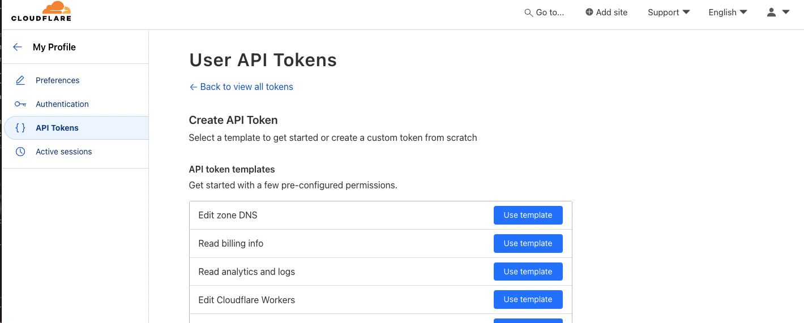
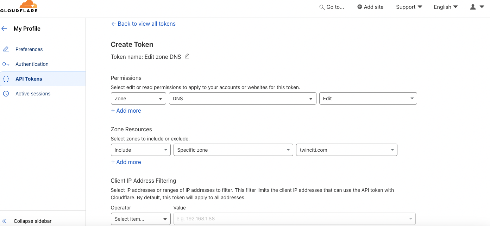

# README for Cloudflare API Key Storage Playbook

This Ansible playbook prompts the user for a Cloudflare API key and stores it securely in AWS Secrets Manager. This API token can then be used in Terraform to configure the Cloudflare provider.

## Prerequisites

- Ansible installed on your machine
- AWS CLI configured with appropriate permissions
- Cloudflare account
- Terraform installed on your machine

## Steps to Create a Cloudflare API Token

1. **Log in to your Cloudflare account**: Go to [Cloudflare](https://dash.cloudflare.com) and log in with your credentials.
2. **Navigate to the API Tokens section**:
   - Click on your profile icon in the top right corner and select **My Profile**.
   - Go to the **API Tokens** tab.
3. **Create a new token**:
   - Click on **Create Token**.
   - **Select a template**: Choose **Edit DNS Zone**.
   - **Zone Resources**: Under the **Zone Resources** section, select the desired zone.
   - **PARAMS**: select other parameters accordingly, if not leave them as it is.
4. **Generate the token**: Click on **Continue to summary**, review the settings, and then click on **Create Token**. Save this token securely as you will need it for the next steps.




## Steps to Use the Playbook

1. Go to the directory where playbook is located `main.yaml` file.

2. **Run the playbook**: Execute the following command to run the playbook:

    ```sh
    ansible-playbook store_cloudflare_key.yml
    ```

3. **Enter your Cloudflare API key**: When prompted, enter the API key generated in the Cloudflare dashboard. This key will be securely stored in AWS Secrets Manager under the name `cloudflare-api-key`.

## Using the Stored API Key in Terraform

To use the stored Cloudflare API key in Terraform, follow these steps:

1. **Configure AWS Secrets Manager as a data source** in your Terraform configuration:

    ```hcl
    provider "aws" {
      region = "us-west-2"
    }

    data "aws_secretsmanager_secret" "cloudflare" {
      name = "cloudflare-api-key"
    }

    data "aws_secretsmanager_secret_version" "cloudflare" {
      secret_id = data.aws_secretsmanager_secret.cloudflare.id
    }

    locals {
      cloudflare_api_key = jsondecode(data.aws_secretsmanager_secret_version.cloudflare.secret_string)["CLOUDFLARE_KEY"]
    }
    ```

2. **Use the API key in your Cloudflare provider configuration**:

    ```hcl
    provider "cloudflare" {
      api_token = local.cloudflare_api_key
    }
    ```

## Important Note

**Do not change the secret name (`cloudflare-api-key`) in AWS Secrets Manager**. If you need to change the secret name, you must also update the Terraform variables accordingly to reflect the new secret name. This ensures that your Terraform configuration can still retrieve and use the Cloudflare API key correctly.